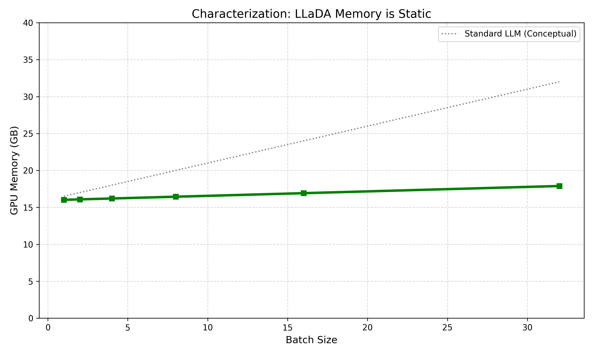
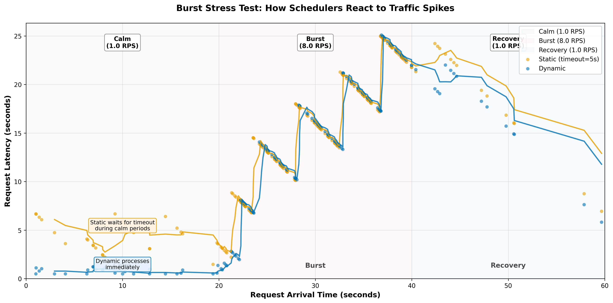
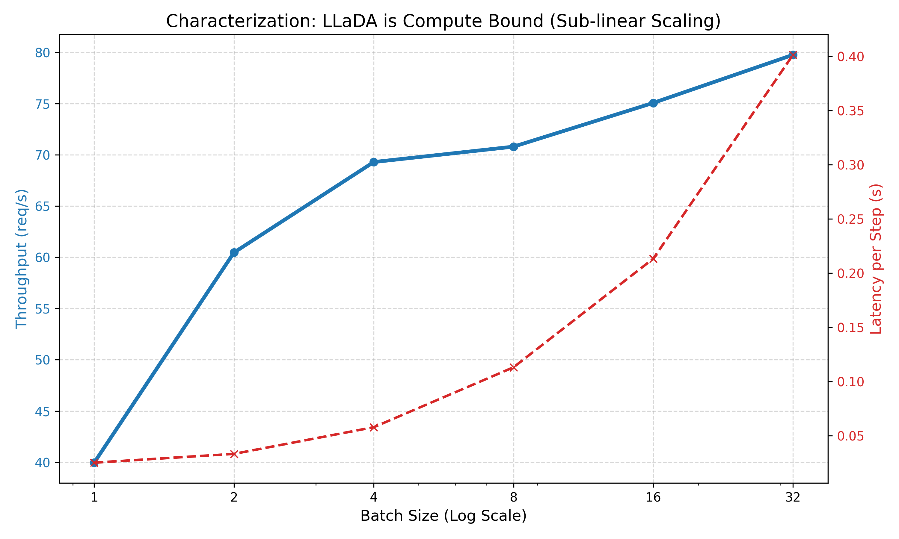
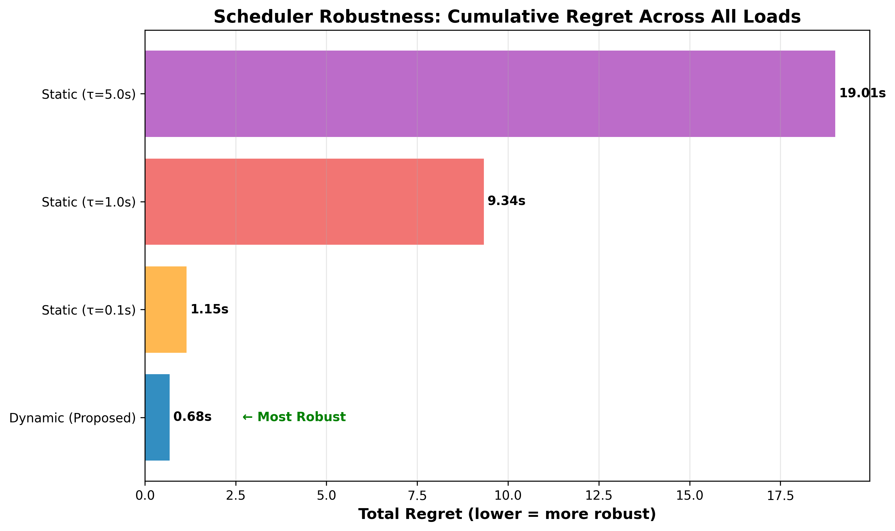

# FluxServe: Characterizing and Scheduling Compute-Bound Diffusion LLMs

A trace-driven simulator and characterization suite for evaluating dynamic batching strategies for diffusion-based large language models (dLLMs) like LLaDA-8B. This project demonstrates that compute-bound dLLMs require a shift from memory-optimized serving (vLLM) to compute-optimized scheduling, achieving **5.5x lower latency** in sparse traffic compared to static baselines.

## Overview

Diffusion LLMs (dLLMs) operate fundamentally differently from Autoregressive models. They are **Compute-Bound** with **Flat Memory Usage**, meaning architectural overheads like PagedAttention are unnecessary. Instead, they benefit from aggressive **Dynamic Batching** to exploit sub-linear compute scaling.

This project:
- **Profiles** LLaDA-8B on Nvidia A100 GPUs to establish ground-truth hardware bottlenecks.
- **Simulates** a custom "Compute-Aware" scheduler against industry-standard Static Batching.
- **Validates** simulation results against real hardware execution (Error < 8%).

### Key Findings
- **dLLMs are NOT Memory Bound:** Memory usage is static (~32GB for LLaDA-8B) regardless of sequence length, making complex memory managers overhead.
- **5.5x Latency Reduction:** In realistic "bursty" workloads, Dynamic Batching reduces average latency during calm periods from **4.41s to 0.80s** by eliminating "ghost latency".
- **Robustness:** Dynamic Batching achieves near-zero **Regret (0.31s)** across all load levels, whereas static policies require brittle manual tuning.
- **Sub-linear Scaling:** Doubling batch size increases latency by only ~1.4x, revealing significant "free compute" capacity.

## Key Results & Characterization

| Characterization | Performance |
| :---: | :---: |
|  <br> **Figure 1:** *dLLM Memory is static (Green), unlike standard LLMs (Gray).* |  <br> **Figure 2:** *Dynamic Batching (Blue) eliminates "ghost latency" during calm periods.* |

| Throughput Scaling | Scheduler Robustness |
| :---: | :---: |
|  <br> **Figure 3:** *Sub-linear latency scaling enables aggressive batching.* |  <br> **Figure 4:** *Dynamic Batching minimizes regret across all loads without tuning.* |
## Setup

### Prerequisites

- TACC Lonestar6 (Nvidia A100 GPU recommended for profiling)
- Conda/Mamba

### Installation

1. **Clone the repository**

```bash
git clone <repository-url>
cd flux-serve
```

2. **Load TACC modules**

```bash
module load cuda/12.2
module load python3
```

3. **Create conda environment**

```bash
cd $WORK
conda env create -f environment.yml
conda activate llada_env
```

4. **Set HuggingFace cache**

```bash
export HF_HOME=/work/$USER/.cache/huggingface
```
## Quick Start

### Run the Simulator

Compare schedulers using the trace-driven simulator (validated against real hardware profiles).

```bash
# Full comparison (RPS 1-10)
python -m simulator.main

# Quick mode (5s duration)
python -m simulator.main --quick
```
## Experiments

### 1. Burst Stress Test

Evaluates behavior under realistic traffic spikes: Calm (1 RPS) → Burst (8 RPS) → Recovery (1 RPS).

```bash
python -m experiments.burst
```

**Result**: Dynamic batching eliminates the "oscillating latency" seen in static batching during sparse traffic, maintaining 0.80s latency vs 4.41s for the baseline.

### 2. Timeout Sensitivity Analysis

Demonstrates the "No Free Lunch" theorem for static batching.

```bash
python -m experiments.sensitivity
```

## Validation & Profiling

To reproduce the hardware characterization or validate the simulator:

```bash
# 1. Profile Compute (Latency vs Batch Size)
python profile_throughput.py

# 2. Profile Memory (Memory vs Time)
python profile_llada.py

# 3. Validate Simulator against Real A100 Execution
python validate_real_system.py
```

**Note**: `validate_real_system.py` runs a 50-request burst on the GPU and compares the wall-clock time to the simulator's prediction.
python validate_real_system.py


## Project Structure

```
flux-serve/
├── assets/            # Graphs and figures
├── simulator/         # Core simulation engine
│   ├── config.py      # Hardware profiles (A100 interpolated data)
│   ├── scheduler.py   # Scheduling logic (Static vs Dynamic)
│   └── simulator.py   # Event loop
├── experiments/       # Research experiments
│   ├── burst.py       # Bursty traffic generation
│   └── sensitivity.py # Timeout sweep
└── validate_real_system.py  # Hardware validation script
```
